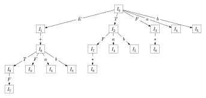
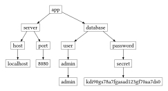

# tdtr

A Typst package for drawing beautiful tidy tree easily

This package use [fletcher](https://typst.app/universe/package/fletcher) to render and customize nodes and edges

## Usage

```typ
#import "@preview/tdtr:0.1.0" : tidy-tree-graph, tidy-tree-draws
```

### from list


```typ
#tidy-tree-graph(compact: true)[
  - $integral_0^infinity e^(-x) dif x = 1$
    - `int main() { return 0; }`
      - Hello
        - This
        - Continue
        - Hello World
      - This
    - _literally_
      - Like
    - *day*
      - tomorrow $1$
]
```



```typ
#tidy-tree-graph(
  spacing: (20pt, 20pt),
  node-inset: 4pt
)[
  - $I_0$
    + $E$
    - $I_1$
      + $+$
      - $I_6$
        + $T$
        - $I_9$
          + $F$
          - $I_7$
        + $F$
        - $I_3$
        + $a$
        - $I_4$
        + $b$
        - $I_5$
    + $T$
    - $I_2$
      + $F$
      - $I_7$
        + $*$
        - $I_8$
      + $a$
      - $I_4$
      + $b$
      - $I_5$
    + $F$
    - $I_3$
      + $*$
      - $I_8$
    + $a$
    - $I_4$
    + $b$
    - $I_5$
]
```


```typ
#tidy-tree-graph(
  draw-edge: tidy-tree-draws.horizontal-vertical-draw-edge
)[
  - Hello
    - World
      - How
        - Whats
          - Day
        - the
        - Time
          - Hello
            - World
              - How
                - Whats
                  - Day
                - the
                - Time
                  - Hello
      - This
      - Day
        - Hello
      - People
    - are
      - Hello
          - World
        - Day
          - Hello
          - World
          - Fine
          - I'm
          - Very
            - Happy
            - That
            - They
            - have
            - what
        - you
        - Byte
        - integer
        - Today
      - you
    - !
      - Fine
      - Day
      - You
        - World
        - This
    - Day One
      - doing
        - abcd
        - efgh
      - today
        - Tomorrow
        - Tomorrow
        - Tomorrow
    - Hello
      - Day
      - One
    - Fine
      - Hello
      - Fine
      - Day
    - Hello
]
```

### from file

#### JSON

`test.json`:

```json
{
    "Hello": {
        "World": {
            "How": {
                "Whats": [
                    "Day",
                    "the",
                    1
                ],
                "the": {},
                "Time": {
                    "Hello": [
                        1, 2, 3, 4, 5
                    ]
                }
            }
        },
        "This": {
            "Hello": {}
        },
        "Day": {},
        "People": {}
    }
}
```


```typ
#tidy-tree-graph(json("test.json"))
```

#### YAML

`test.yaml`:

```yaml
app:
  server:
    host: localhost
    port: 8080
  database:
    user: 
      admin: admin
    password: 
      secret: kdi90gs78a7fgasad123gf70aa7ds0
```



```typ
#tidy-tree-graph(yaml("test.yaml"))
```

#### Note

- The json and yaml files should not contain any structure that an dictionary is included in an array, e.g.

    ```jsonc
    {
        "A": [
            {"B": "C"}  // this structure is not supported
        ],
        "B": [
            "D"  // this structure is supported
        ]
    }
    ```

    ```yaml
    A:
      - B: C  # this structure is not supported
    B:
      - D  # this structure is supported
    ```
